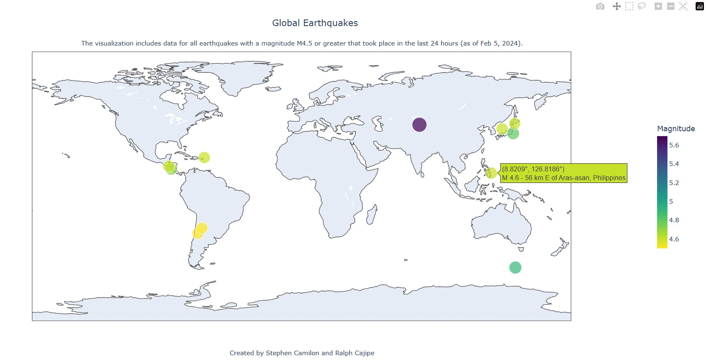

# Global Earthquake Data Visualization

## Description
This project visualizes global earthquake data using Python and Plotly. It fetches data from a JSON file containing information about earthquakes around the world, including their magnitudes and locations, and generates an interactive world map. Earthquakes are categorized by their magnitude on the [Richter scale](https://en.wikipedia.org/wiki/Richter_magnitude_scale).

## Data
The project includes data for all earthquakes with a magnitude M4.5 or greater that took place in the last 24 hours (as of Feb 5, 2024). This data comes from one of the United States Geological Survey's earthquake data feeds, which you can find [here](https://earthquake.usgs.gov/earthquakes/feed/v1.0/geojson.php).

## Features
- Fetches and processes earthquake data from a JSON file.
- Visualizes the data on a world map using Plotly.
- The size and color of the markers on the map represent the magnitude of the earthquakes.
- Hovering over a marker shows the title of the earthquake.
- Can be run as a standalone script or as a Flask web application.

## Installation
1. Clone this repository.
2. Install the required Python packages: `pip install plotly flask`

## Usage
### Standalone Script
Run the main script to generate the HTML file containing the world map: `python eq_explore_data.py`

### Flask Web Application
Run the Flask application: `python server.py`
Then, open a web browser and navigate to `http://localhost:5000` to view the interactive world map.

## Output
The output is an HTML file named `global_earthquakes.html`. Open this file in a web browser to view the interactive world map. When run as a Flask web application, the map is served at `http://localhost:5000`.

## Contributing
Pull requests are welcome. For major changes, please open an issue first to discuss what you would like to change.

## License
[MIT](https://choosealicense.com/licenses/mit/)